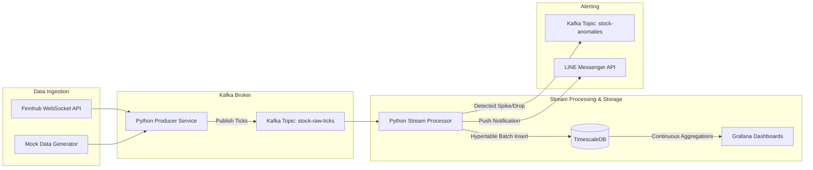

# Real-Time Stock Anomaly Detection Data Streaming Pipeline

[](https://www.python.org/)
[](https://kafka.apache.org/)
[](https://www.timescale.com/)
[](https://grafana.com/)
[](https://developers.line.biz/)

A production-grade, end-to-end Data Engineering streaming pipeline that ingests real-time stock market tick data, detects price anomalies (Spikes & Drops) via sliding window calculations, persists data in TimescaleDB hypertables, visualizes real-time analytics on Grafana dashboards, and delivers instant notifications via LINE Messenger.

---

## 📐 Architecture Overview


-->

---

## 🛠️ Tech Stack & Features

* **Broker:** Apache Kafka (KRaft Mode - no Zookeeper dependency)
* **Storage:** TimescaleDB (Hypertables for time-series tick storage & Continuous Aggregations for 1-minute OHLCV candles)
* **Ingestion Service:** Python Async (`aiokafka`, `websockets`, `pydantic`) supporting both **Live Finnhub WebSocket** and **Synthetic Mock Generator** (for 24/7 testing outside US market hours)
* **Stream Processor:** In-Memory Sliding Window (% price change calculation over 60s window with automatic cooldowns)
* **Visualization:** Grafana (Auto-provisioned datasource & pre-built stock monitoring dashboards)
* **Alerting:** LINE Messaging API Push Notifications with console logger fallback

---

## 🚀 Quick Start Guide

### 1. Start Infrastructure (Docker Containers)

Ensure Docker Desktop is running, then start Kafka, TimescaleDB, and Grafana:

```bash
docker compose up -d
```

Check running containers:
* **Apache Kafka (KRaft):** `localhost:9092`
* **TimescaleDB:** `localhost:5433` (`postgres` / `postgres`)
* **Grafana:** `http://localhost:3000` (`admin` / `admin`)

---

### 2. Install Python Dependencies

```bash
python3 -m venv venv
source venv/bin/activate
pip install -r requirements.txt
```

---

### 3. Configure Environment Variables

Edit `.env` file to customize settings:

```env
# MOCK_MODE=true runs synthetic data generator (no API key needed)
MOCK_MODE=true
SYMBOLS=AAPL,GOOGL,TSLA,NVDA

# Optional Finnhub & LINE API Keys
FINNHUB_API_KEY=your_key_here
LINE_CHANNEL_ACCESS_TOKEN=your_token_here
LINE_USER_ID=your_user_id_here
```

---

### 4. Run Pipeline Services

In terminal window 1: Start the **Stream Processor & Anomaly Engine**:

```bash
python3 -m src.processor
```

In terminal window 2: Start the **Stock Data Producer**:

```bash
python3 -m src.producer
```

---

## 📊 Monitoring & Dashboards

1. Open Grafana at [http://localhost:3000](http://localhost:3000) (Login: `admin` / `admin`).
2. Navigate to **Dashboards** $\rightarrow$ **Real-Time Stock Anomaly Monitoring**.
3. Observe real-time price charts and live anomaly detection tables.

---

## 🚨 LINE Notification Example

When a stock price experiences a sudden spike ($\ge +2.0\%$) or drop ($\le -2.0\%$), an instant alert is pushed to LINE Messenger:

```text
🚨 STOCK ANOMALY ALERT 📈

• Symbol: AAPL
• Anomaly: SPIKE (+3.50%)
• Current Price: $232.88
• Previous Price: $225.00
• Timestamp: 2026-08-13 18:52:00 UTC
```
